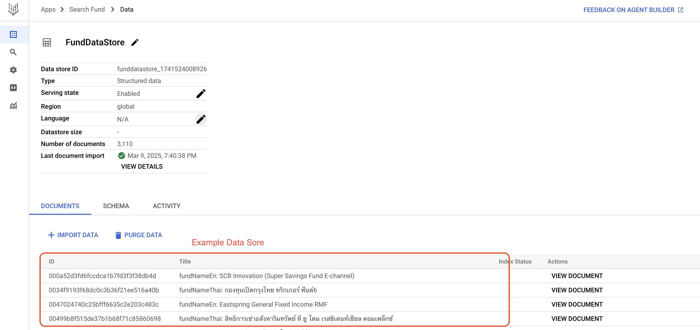

# vertex-ai-search-conversational

# Product Search - Vertex Search AI 

### 1. Create a GCS bucket (replace with your desired bucket name and location) 
```
export YOUR_BUCKET_NAME=XXXX
export YOUR_BUCKET_LOCATION=asia-southeast1

gsutil mb -l $YOUR_BUCKET_LOCATION gs://$YOUR_BUCKET_NAME
```

#### 2. Upload the data file to the bucket
```
gsutil cp data_store/funds.ndjson gs://$YOUR_BUCKET_NAME/data_store/product_retails_search.ndjson
```


### 3. Check file existing
```
gsutil ls gs://$YOUR_BUCKET_NAME/data_store/funds.ndjson
```

### 4. Goto Vertex AI Search Page in Your Google Cloud Project 
1. Create Vertex AI Seatch 
2. Create DataStore from GSC 
3. Setting the Search Agent


# Fund Search - Vertex Search AI 
Step: 

### 1. Create a GCS bucket (replace with your desired bucket name and location) 
you'll store the data you want Vertex AI Search to index.
```
export YOUR_BUCKET_NAME=XXXX
export YOUR_BUCKET_LOCATION=asia-southeast1

gsutil mb -l $YOUR_BUCKET_LOCATION gs://$YOUR_BUCKET_NAME
```

#### 2. Upload the data file to the bucket
You'll upload your product or fund data in NDJSON format to this bucket.
```
gsutil cp data_store/funds.ndjson gs://$YOUR_BUCKET_NAME/data_store/funds.ndjson
```

### 3. Check file existing
```
gsutil ls gs://$YOUR_BUCKET_NAME/data_store/funds.ndjson
```

### 4. Goto Vertex AI Search Page in Your Google Cloud Project 
#### 1. Create Vertex AI Seatch 
You'll go to the Vertex AI Search console and start creating your search application.
 
Go to Vertex AI Search landing page. You would see a button or link that says something like "Create search application," "New search," or "Create."


Enter the name for Agent App name

#### 2. Create DataStore from GSC 
You'll connect your GCS bucket as a data source to create a Data Store and you'll configure the search agent to work with your Data Store.


In this step, you will need to specify the name of the datastore. For example, fund_datastore.
 
Here you'll select "Cloud Storage" as the data source to import your data.

 
You will have to select file type on this step. Select `NDJSON` format.
you have to input the path to your data file in GCS, it will be something like this

 
you'll click "Create"


After reviewing, "Continue" to start importing your data into the Data Store.


#### 3. Setting the Search Agent
You will setting up the agent to use search result summarization with Gemini
 
 


#### Instruction:
- Summary the NAV the fund detail and provide recommendation based on YTD value 
- Answer in Thai